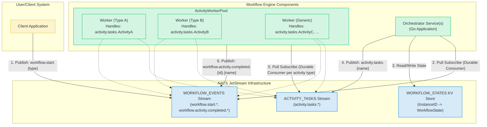
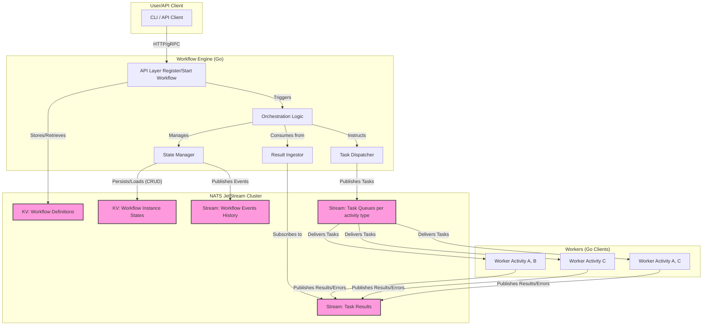

## Engine-based worker

```mermaid
graph TD
    subgraph User/Client System
        ClientApp[Client Application]
    end

    subgraph NATS JetStream Infrastructure
        direction LR
        WorkflowEventsStream["WORKFLOW_EVENTS Stream<br>(workflow.start.*,<br>workflow.activity.completed.*)"]
        ActivityTasksStream["ACTIVITY_TASKS Stream<br>(activity.tasks.*)"]
        WorkflowStatesKV["WORKFLOW_STATES KV Store<br>(InstanceID -> WorkflowState)"]
    end

    subgraph Workflow Engine Components
        direction TB
        OrchestratorService["Orchestrator Service(s)<br>(Go Application)"]
        ActivityWorkerPool["Activity Worker Pool(s)<br>(Go Application)"]

        subgraph ActivityWorkerPool
            direction LR
            WorkerA["Worker (Type A)<br>Handles: activity.tasks.ActivityA"]
            WorkerB["Worker (Type B)<br>Handles: activity.tasks.ActivityB"]
            WorkerGeneric["Worker (Generic)<br>Handles: activity.tasks.ActivityC, ..."]
        end
    end

    %% Interactions / Data Flow
    ClientApp -- "1. Publish: workflow.start.{type}" --> WorkflowEventsStream

    OrchestratorService -- "2. Pull Subscribe (Durable Consumer)" --> WorkflowEventsStream
    OrchestratorService -- "3. Read/Write State" --> WorkflowStatesKV
    OrchestratorService -- "4. Publish: activity.tasks.{name}" --> ActivityTasksStream

    ActivityWorkerPool -- "5. Pull Subscribe (Durable Consumer per activity type)" --> ActivityTasksStream
    WorkerA -.-> ActivityTasksStream
    WorkerB -.-> ActivityTasksStream
    WorkerGeneric -.-> ActivityTasksStream

    ActivityWorkerPool -- "6. Publish: workflow.activity.completed.{id}.{name}" --> WorkflowEventsStream
    WorkerA -.-> WorkflowEventsStream
    WorkerB -.-> WorkflowEventsStream
    WorkerGeneric -.-> WorkflowEventsStream

    %% Styling (Optional, makes it a bit clearer)
    classDef natsAsset fill:#D6EAF8,stroke:#5DADE2,stroke-width:2px;
    class WorkflowEventsStream,ActivityTasksStream,WorkflowStatesKV natsAsset;

    classDef serviceComponent fill:#D5F5E3,stroke:#58D68D,stroke-width:2px;
    class OrchestratorService,ActivityWorkerPool,WorkerA,WorkerB,WorkerGeneric serviceComponent;

    classDef clientApp fill:#FCF3CF,stroke:#F7DC6F,stroke-width:2px;
    class ClientApp clientApp;
```

## Client-based worker

```mermaid
graph TD
    subgraph "User/API Client"
        CLI[CLI / API Client]
    end

    subgraph "Workflow Engine (Go)"
        EngineAPI[API Layer Register/Start Workflow]
        Orchestrator[Orchestration Logic]
        StateMgr[State Manager]
        TaskDispatcher[Task Dispatcher]
        ResultIngestor[Result Ingestor]
    end

    subgraph "NATS JetStream Cluster"
        KVDefs[KV: Workflow Definitions]
        KVInstances[KV: Workflow Instance States]
        StreamEvents[Stream: Workflow Events History]
        StreamTasks[Stream: Task Queues per activity type]
        StreamResults[Stream: Task Results]
    end

    subgraph "Workers (Go Clients)"
        Worker1[Worker Activity A, B]
        Worker2[Worker Activity C]
        WorkerN[Worker Activity A, C]
    end

    CLI -- HTTP/gRPC --> EngineAPI
    EngineAPI -- Stores/Retrieves --> KVDefs
    EngineAPI -- Triggers --> Orchestrator

    Orchestrator -- Manages --> StateMgr
    Orchestrator -- Instructs --> TaskDispatcher
    Orchestrator -- Consumes from --> ResultIngestor

    StateMgr -- Persists/Loads (CRUD) --> KVInstances
    StateMgr -- Publishes Events --> StreamEvents

    TaskDispatcher -- Publishes Tasks --> StreamTasks
    ResultIngestor -- Subscribes to --> StreamResults

    StreamTasks -- Delivers Tasks --> Worker1
    StreamTasks -- Delivers Tasks --> Worker2
    StreamTasks -- Delivers Tasks --> WorkerN

    Worker1 -- Publishes Results/Errors --> StreamResults
    Worker2 -- Publishes Results/Errors --> StreamResults
    WorkerN -- Publishes Results/Errors --> StreamResults

    %% Styling
    classDef nats fill:#f9d,stroke:#333,stroke-width:2px;
    class KVDefs,KVInstances,StreamEvents,StreamTasks,StreamResults nats;
```
