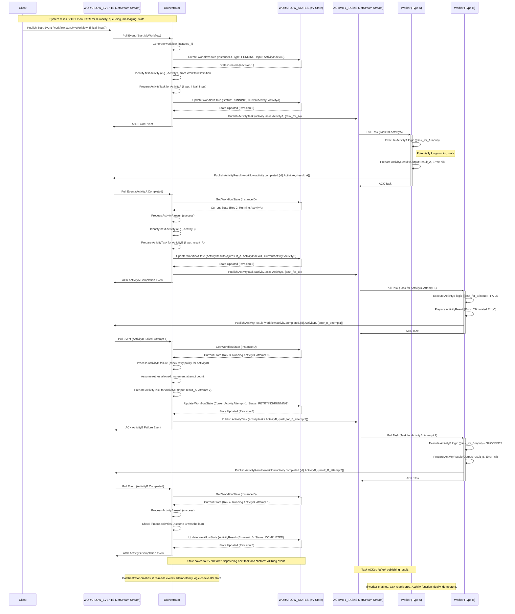

```mermaid
sequenceDiagram
    participant Client
    participant NATS_WORKFLOW_EVENTS_Stream as WORKFLOW_EVENTS (JetStream Stream)
    participant Orchestrator
    participant NATS_WORKFLOW_STATES_KV as WORKFLOW_STATES (KV Store)
    participant NATS_ACTIVITY_TASKS_Stream as ACTIVITY_TASKS (JetStream Stream)
    participant ActivityWorker_A as Worker (Type A)
    participant ActivityWorker_B as Worker (Type B)

    %% Phase 1 & 2: Understanding, Constraints, Mapping (Conceptual - Not directly in sequence but informs it)
    Note over Client, Orchestrator: System relies SOLELY on NATS for durability, queueing, messaging, state.

    %% Phase 3 & 4: Components, Interactions, Data Structures (Illustrated by the flow)

    %% === Workflow Start ===
    Client->>+NATS_WORKFLOW_EVENTS_Stream: Publish Start Event (workflow.start.MyWorkflow, {initial_input})
    NATS_WORKFLOW_EVENTS_Stream->>+Orchestrator: Pull Event (Start MyWorkflow)
    Orchestrator->>Orchestrator: Generate workflow_instance_id
    Orchestrator->>+NATS_WORKFLOW_STATES_KV: Create WorkflowState (InstanceID, Type, PENDING, Input, ActivityIndex=0)
    NATS_WORKFLOW_STATES_KV-->>-Orchestrator: State Created (Revision 1)
    Orchestrator->>Orchestrator: Identify first activity (e.g., ActivityA) from WorkflowDefinition
    Orchestrator->>Orchestrator: Prepare ActivityTask for ActivityA (Input: initial_input)
    Orchestrator->>+NATS_WORKFLOW_STATES_KV: Update WorkflowState (Status: RUNNING, CurrentActivity: ActivityA)
    NATS_WORKFLOW_STATES_KV-->>-Orchestrator: State Updated (Revision 2)
    Orchestrator->>+NATS_ACTIVITY_TASKS_Stream: Publish ActivityTask (activity.tasks.ActivityA, {task_for_A})
    Orchestrator->>-NATS_WORKFLOW_EVENTS_Stream: ACK Start Event

    %% === Activity A Execution ===
    NATS_ACTIVITY_TASKS_Stream->>+ActivityWorker_A: Pull Task (Task for ActivityA)
    ActivityWorker_A->>ActivityWorker_A: Execute ActivityA logic ({task_for_A.input})
    Note right of ActivityWorker_A: Potentially long-running work
    ActivityWorker_A->>ActivityWorker_A: Prepare ActivityResult (Output: result_A, Error: nil)
    ActivityWorker_A->>+NATS_WORKFLOW_EVENTS_Stream: Publish ActivityResult (workflow.activity.completed.{id}.ActivityA, {result_A})
    ActivityWorker_A->>-NATS_ACTIVITY_TASKS_Stream: ACK Task

    %% === Orchestrator Processes Activity A Completion ===
    NATS_WORKFLOW_EVENTS_Stream->>+Orchestrator: Pull Event (ActivityA Completed)
    Orchestrator->>+NATS_WORKFLOW_STATES_KV: Get WorkflowState (InstanceID)
    NATS_WORKFLOW_STATES_KV-->>-Orchestrator: Current State (Rev 2: Running ActivityA)
    Orchestrator->>Orchestrator: Process ActivityA result (success)
    Orchestrator->>Orchestrator: Identify next activity (e.g., ActivityB)
    Orchestrator->>Orchestrator: Prepare ActivityTask for ActivityB (Input: result_A)
    Orchestrator->>+NATS_WORKFLOW_STATES_KV: Update WorkflowState (ActivityResults[A]=result_A, ActivityIndex=1, CurrentActivity: ActivityB)
    NATS_WORKFLOW_STATES_KV-->>-Orchestrator: State Updated (Revision 3)
    Orchestrator->>+NATS_ACTIVITY_TASKS_Stream: Publish ActivityTask (activity.tasks.ActivityB, {task_for_B})
    Orchestrator->>-NATS_WORKFLOW_EVENTS_Stream: ACK ActivityA Completion Event

    %% === Activity B Execution (Illustrating a Retry) ===
    NATS_ACTIVITY_TASKS_Stream->>+ActivityWorker_B: Pull Task (Task for ActivityB, Attempt 1)
    ActivityWorker_B->>ActivityWorker_B: Execute ActivityB logic ({task_for_B.input}) - FAILS
    ActivityWorker_B->>ActivityWorker_B: Prepare ActivityResult (Error: "Simulated Error")
    ActivityWorker_B->>+NATS_WORKFLOW_EVENTS_Stream: Publish ActivityResult (workflow.activity.completed.{id}.ActivityB, {error_B_attempt1})
    ActivityWorker_B->>-NATS_ACTIVITY_TASKS_Stream: ACK Task

    %% === Orchestrator Processes Activity B Failure & Retries ===
    NATS_WORKFLOW_EVENTS_Stream->>+Orchestrator: Pull Event (ActivityB Failed, Attempt 1)
    Orchestrator->>+NATS_WORKFLOW_STATES_KV: Get WorkflowState (InstanceID)
    NATS_WORKFLOW_STATES_KV-->>-Orchestrator: Current State (Rev 3: Running ActivityB, Attempt 0)
    Orchestrator->>Orchestrator: Process ActivityB failure (check retry policy for ActivityB)
    Orchestrator->>Orchestrator: Assume retries allowed. Increment attempt count.
    Orchestrator->>Orchestrator: Prepare ActivityTask for ActivityB (Input: result_A, Attempt 2)
    Orchestrator->>+NATS_WORKFLOW_STATES_KV: Update WorkflowState (CurrentActivityAttempt=1, Status: RETRYING/RUNNING)
    NATS_WORKFLOW_STATES_KV-->>-Orchestrator: State Updated (Revision 4)
    Orchestrator->>+NATS_ACTIVITY_TASKS_Stream: Publish ActivityTask (activity.tasks.ActivityB, {task_for_B_attempt2})
    Orchestrator->>-NATS_WORKFLOW_EVENTS_Stream: ACK ActivityB Failure Event

    %% === Activity B Retry Execution (Success) ===
    NATS_ACTIVITY_TASKS_Stream->>+ActivityWorker_B: Pull Task (Task for ActivityB, Attempt 2)
    ActivityWorker_B->>ActivityWorker_B: Execute ActivityB logic ({task_for_B.input}) - SUCCEEDS
    ActivityWorker_B->>ActivityWorker_B: Prepare ActivityResult (Output: result_B, Error: nil)
    ActivityWorker_B->>+NATS_WORKFLOW_EVENTS_Stream: Publish ActivityResult (workflow.activity.completed.{id}.ActivityB, {result_B_attempt2})
    ActivityWorker_B->>-NATS_ACTIVITY_TASKS_Stream: ACK Task

    %% === Orchestrator Processes Activity B Completion & Workflow End ===
    NATS_WORKFLOW_EVENTS_Stream->>+Orchestrator: Pull Event (ActivityB Completed)
    Orchestrator->>+NATS_WORKFLOW_STATES_KV: Get WorkflowState (InstanceID)
    NATS_WORKFLOW_STATES_KV-->>-Orchestrator: Current State (Rev 4: Running ActivityB, Attempt 1)
    Orchestrator->>Orchestrator: Process ActivityB result (success)
    Orchestrator->>Orchestrator: Check if more activities (Assume B was the last)
    Orchestrator->>+NATS_WORKFLOW_STATES_KV: Update WorkflowState (ActivityResults[B]=result_B, Status: COMPLETED)
    NATS_WORKFLOW_STATES_KV-->>-Orchestrator: State Updated (Revision 5)
    Orchestrator->>-NATS_WORKFLOW_EVENTS_Stream: ACK ActivityB Completion Event

    %% Phase 5 & 6: Durability, Atomicity, Implementation (Illustrated by KV updates before task dispatches & ACKs)
    Note over Orchestrator, NATS_WORKFLOW_STATES_KV: State saved to KV *before* dispatching next task and *before* ACKing event.
    Note over ActivityWorker_A, NATS_ACTIVITY_TASKS_Stream: Task ACKed *after* publishing result.

    %% Phase 7: Testing (Conceptual - Envision crashes at various points)
    Note over Orchestrator: If orchestrator crashes, it re-reads events. Idempotency logic checks KV state.
    Note over ActivityWorker_A: If worker crashes, task redelivered. Activity function ideally idempotent.
```
